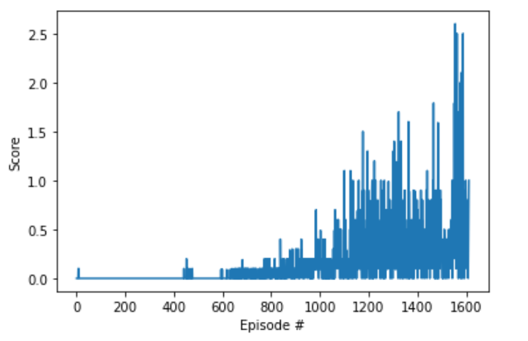

## Learning Algorithm

The agent is trained with the [Multi Agent DDPG](https://arxiv.org/abs/1706.02275). The full algorithm is described in the METHODS section of the paper.

The information flow in a MADDPG algorithm is depeicted below (Screenshot from the paper)


## Parameters

- BUFFER_SIZE = int(1e5)  # replay buffer size
- BATCH_SIZE = 250         # minibatch size
- GAMMA = 0.99            # discount factor
- TAU = 1e-3              # for soft update of target parameters
- LR_ACTOR = 1e-4         # learning rate of the actor
- LR_CRITIC = 1e-3        # learning rate of the critic 2539
- WEIGHT_DECAY = 0        # L2 weight decay

## Architecture of each of the 2 Agents

Actor

- 2 fully connected layers with 200 and 150 units each

Critic

- 2 fully connected layers with 200 and 150 units each

ReplayBuffer

- A fixed size buffer of size 1e5

## Plot of Rewards

```
Episode 100	Average score: 0.003
Episode 200	Average score: 0.000
Episode 300	Average score: 0.000
Episode 400	Average score: 0.000
Episode 500	Average score: 0.008
Episode 600	Average score: 0.003
Episode 700	Average score: 0.026
Episode 800	Average score: 0.043
Episode 900	Average score: 0.082
Episode 1000	Average score: 0.126
Episode 1100	Average score: 0.159
Episode 1200	Average score: 0.265
Episode 1300	Average score: 0.299
Episode 1400	Average score: 0.374
Episode 1500	Average score: 0.356
Episode 1600	Average score: 0.482
Solved in episode: 1611 	Average score: 0.502
```

The plot of the scores over all episodes is shown below



The plot of the average scores as training progresses is shown below


## Observations/Issues

* The Agent was initially training very slowly but picked up rewards fast after around 800 episodes. 

## Trained Models

- The ```agent1_checkpoint_actor.pth``` file represents the first agent actor
- The ```agent1_checkpoint_critic.pth``` file represents the first agent critic
- The ```agent2_checkpoint_actor.pth``` file represents the second agent actor
- The ```agent2_checkpoint_critic.pth``` file represents the second agent critic

## Further Improvements
The following techniques can be tried out to further improve the performance of the network
- [Prioritized Experience Replay](https://arxiv.org/abs/1511.05952): This technique prioritizes the experiences and chooses the best experience for further training when sampling from the buffer. This is known to reduce the training time and make the training more efficient.
- [Asynchornous Actor Critic Agent](https://medium.com/emergent-future/simple-reinforcement-learning-with-tensorflow-part-8-asynchronous-actor-critic-agents-a3c-c88f72a5e9f2): This technique trains multiple worker agents that interact with a glocal network asynchronously to optimize the policy and value function. This way, each of these agents interacts with it’s own copy of the environment at the same time as the other agents are interacting with their environments.
- [Proximal Policy Optimization](https://arxiv.org/abs/1707.06347): This technique modifies the parameters of the network in such a way that the new set of parameters is looked for in the immediate neighbourhood of the parameters in the previous iteration of the training. This is shown also to be an efficient way of training the network so the search space is more optimal. 
